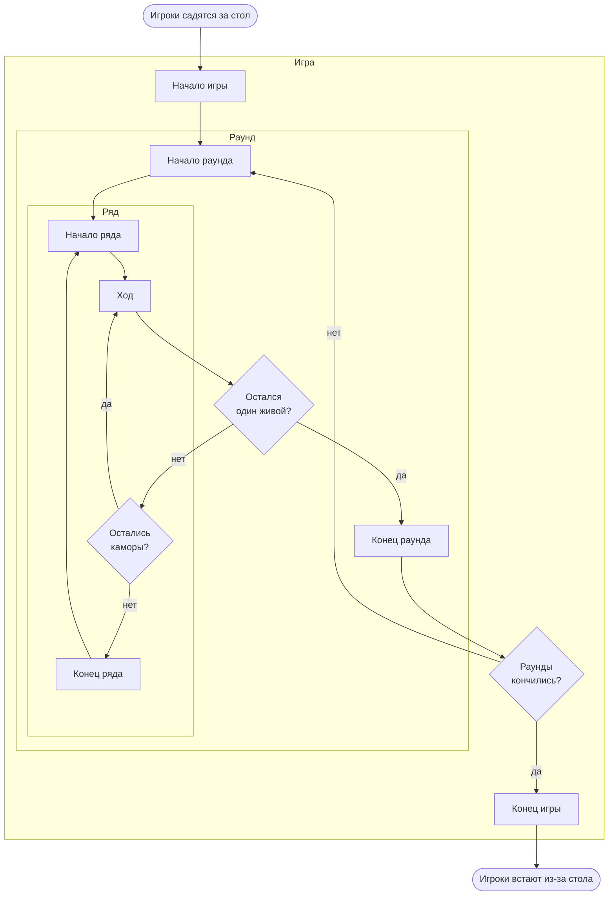

# Общее строение

Игра вкладывается как матрёшка.

[Игра](chapters/game.md)

[Раунд](chapters/round.md)

[Ряд](chapters/spread.md)

[Ход](chapters/turn.md)

## Схема

```mermaid
flowchart TD
    A(["Игроки садятся за стол"])
    subgraph G ["Игра"]
        B["Начало игры"]
        subgraph R ["Раунд"]
            C["Начало раунда"]
            subgraph S ["Ряд"]
                D["Начало ряда"]
                E["Ход"]
                H{"Остались<br/>каморы?"}
                J["Конец ряда"]
            end
            F{"Остался<br/>один живой?"}
            K["Конец раунда"]
        end
        L{"Раунды<br/>кончились?"}
        M["Конец игры"]
    end
    N(["Игроки встают из-за стола"])

    A --> B --> C --> D --> E --> F
    F -- нет --> H
    H -- да --> E
    H -- нет --> J --> D
    F -- да --> K --> L
    L -- нет --> C
    L -- да --> M --> N

    click B "../chapters/game/" "Игра"
    click C "../chapters/round/" "Раунд"
    click D "../chapters/spread/" "Ряд"
    click E "../chapters/turn/" "Ход"
    click J "../chapters/spread/" "Ряд"
    click K "../chapters/round/" "Раунд"
    click M "../chapters/game/" "Игра"
```
